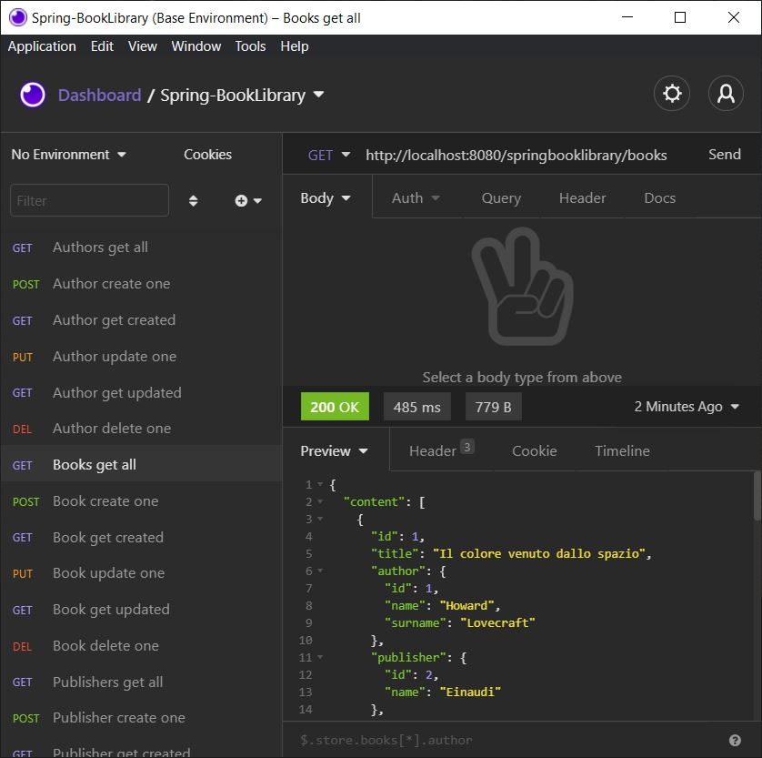

## Spring-BookLibrary
> Spring RESTFul BookLibrary (Case Study)

A small but powerful RESTFul service for the management of a Book Library.


## Motivation
This project is aimed on enforcing the knowledge of Spring Framework, REST services
and related technologies with emphasis on testability.


## Technologies
Project is created with:
* Java 11
* Maven
* PostgreSQL
* Spring Boot 2.3.9
* Spring Web
* Spring Data
* DBUnit 2.5.4
* Spring Test DBUnit 1.3.0
* Jackson 2.11.1


## Features
- [x] Book management
- [x] User management
- [ ] User restrictions of access based on roles management
- [ ] Reservation management


## Setup
Spring-BookLibrary is a [Spring Boot](https://spring.io/guides/gs/spring-boot) application built using [Maven](https://spring.io/guides/gs/maven/). You can build a jar file and run it from the command line:


```
git clone https://github.com/niolikon/Spring-BookLibrary.git
cd Spring-BookLibrary
./mvnw package
java -jar target/*.jar
```

## Test
This project provides a [sample dashboard](Spring-BootLibrary_Insomnia-Dashboard) for [Insomnia REST Client](https://insomnia.rest/)
with some pre-configured REST requests.



# License

The Spring PetClinic sample application is released under [MIT License](LICENSE).
